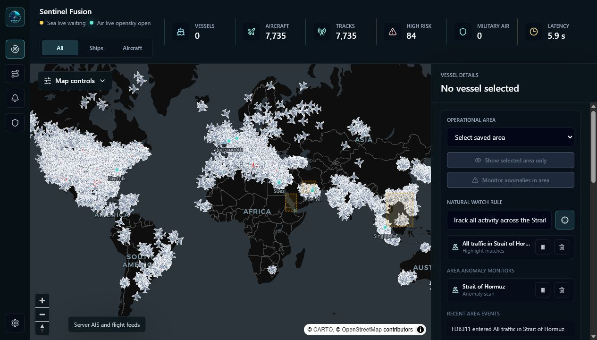
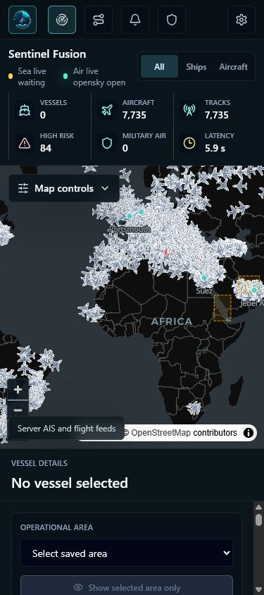

# Sentinel Fusion

Sentinel Fusion is a live-first maritime and aviation intelligence dashboard. It combines server-side AISstream vessel ingestion, live aircraft tracking, MapLibre map visualisation, OpenAI-backed analysis, web-intelligence enrichment, and OSINT area context into one operations view.

The application is a proof of concept, but it is built as a real pnpm monorepo with shared contracts, live-provider adapters, explicit mock/replay modes, tests, security documentation, and local-first deployment defaults.

## Screenshots

### Live Operations Dashboard



### Responsive Mobile Layout



## What The App Can Do

### Live Sea And Air Tracking

- Ingest live AISstream vessel data server-side, with mock and replay modes for offline development.
- Ingest live aircraft positions through OpenSky by default, with ADS-B Exchange support when a provider key is configured.
- Show vessels and aircraft on a MapLibre map with distinct ship and aircraft symbols.
- Highlight selected vessels or aircraft, zoom to them, and keep a visible selected track.
- Rebuild observed vessel and aircraft tracks from received position updates.
- Filter the map by `All`, `Ships`, or `Aircraft`.
- Show provider state, message counts, latency, dropped frames, reconnects, and stale-feed health.

### Analysis And Intelligence

- Ask natural-language questions about named areas, drawn boxes, selected vessels, or current visible traffic.
- Draw a box on the map and analyse only the vessels and aircraft inside it.
- Select saved operational areas such as Portsmouth, Hormuz, Gibraltar, Suez, Singapore, the English Channel, Taiwan Strait, and the South China Sea.
- Use area-only mode to hide traffic outside the selected area while keeping updates dynamic as contacts enter and leave.
- Add natural watch rules such as tracking activity around a named strait or port.
- Save mission routines with manual, daily, or weekly cadence metadata.
- Launch vessel and aircraft web-intelligence enrichment from selected contacts.
- Feed cached vessel and aircraft web-intel context into later AI analysis.

### OSINT Context

- Marine weather from Open-Meteo for analysed areas.
- Active fire and thermal anomaly context from NASA FIRMS when `FIRMS_MAP_KEY` is configured.
- Airport and runway context from OurAirports for analysed areas and selected aircraft.
- Satellite snapshot context from NASA GIBS public WMS imagery.
- Conflict and protest event context from ACLED when ACLED credentials are configured.
- Toggleable map intelligence layers for ports, airports, chokepoints, conflict events, fire points, risk zones, shipping lanes, and maritime zones.

### Alerts, Filters And Operations

- Alert presets for high-risk ships, classified vessels, emergency aircraft, classified aircraft, watched areas, anomalies, provider health, and stale contacts.
- Acknowledge, dismiss, restore, and inspect alert items.
- Aircraft filters for military, government, commercial, emergency/squawk, airborne state, altitude, speed, search text, and provider state.
- Combined sea/air military intel panel with aircraft and vessel focus.
- Feed-confidence controls that can hide stale or unhealthy contacts while preserving selected contacts.

### Security Defaults

- AISstream, OpenAI, flight-provider, FIRMS, and ACLED credentials stay in the API process.
- Browser env variables use only public `VITE_` endpoint settings.
- CORS and WebSocket origins are allow-listed.
- API rate limiting is enabled.
- Provider URLs are fixed or operator-configured, not browser-controlled.
- Public URLs returned by AI/web-intel are validated before rendering.
- AIS, ADS-B, provider, and model text is rendered as text, not raw HTML.

See [docs/SECURITY_MODEL.md](docs/SECURITY_MODEL.md) for the full security model.

## Repository Layout

```text
apps/
  api/       Fastify API, live data ingestion, WebSockets, provider context, OpenAI services
  web/       React, Vite, Tailwind, MapLibre dashboard
packages/
  shared/    Shared TypeScript types and Zod schemas
docs/        Architecture, implementation plan, security notes, agent framework, development log
```

## Requirements

- Node.js 22 or later
- pnpm 10 via Corepack
- AISstream API key for live vessel tracking
- OpenAI API key for live AI analysis and web-intel enrichment
- Optional provider credentials for ADS-B Exchange, OpenSky OAuth, NASA FIRMS, and ACLED

## Environment Files

There are separate env files because the API, web app, and Docker Compose have different trust boundaries.

- `apps/api/.env`: API runtime settings and all secrets for local `pnpm dev`.
- `apps/web/.env`: public browser endpoint settings only.
- `.env`: Docker Compose substitution values only.

Create local env files from the examples:

```powershell
Copy-Item apps/api/.env.example apps/api/.env
Copy-Item apps/web/.env.example apps/web/.env
Copy-Item .env.example .env
```

Do not put real keys in any `.env.example` file. Do not put secrets in `apps/web/.env` or any `VITE_` variable.

## Minimum Local Setup

1. Install dependencies.

```powershell
corepack enable
corepack prepare pnpm@10.12.1 --activate
pnpm install
```

2. Edit `apps/api/.env`.

For live-first local use, set at least:

```text
AISSTREAM_API_KEY=your_aisstream_key
OPENAI_API_KEY=your_openai_key
ANALYSIS_API_TOKEN=choose_a_local_token_at_least_16_chars
```

`AISSTREAM_BBOXES` defaults to a worldwide AISstream subscription:

```text
AISSTREAM_BBOXES=[[[-90,-180],[90,180]]]
```

For aircraft, the default is:

```text
FLIGHT_MODE=live
FLIGHT_PROVIDER=opensky
FLIGHT_POLL_INTERVAL_MS=90000
```

OpenSky can rate-limit broad worldwide polling. The app reports provider errors and retry guidance instead of silently switching to mock data. For ADS-B Exchange, set:

```text
FLIGHT_PROVIDER=adsbexchange
FLIGHT_API_KEY=your_provider_key
```

3. Edit `apps/web/.env` only if your API or WebSocket URLs differ from local defaults.

```text
VITE_API_BASE_URL=http://localhost:4000
VITE_WS_URL=ws://localhost:4000/ws/vessels
VITE_FLIGHT_WS_URL=ws://localhost:4000/ws/aircraft
```

4. Start the app.

```powershell
pnpm dev
```

The web app runs at `http://localhost:5173`. The API runs at `http://localhost:4000`.

## Docker Compose Setup

Docker Compose uses the root `.env` file for variable substitution.

```powershell
Copy-Item .env.example .env
```

Set at least `AISSTREAM_API_KEY` and `OPENAI_API_KEY` in `.env`, then run:

```powershell
docker compose up --build
```

Compose binds the API and web ports to `127.0.0.1` for local development. Do not reuse the Compose file as a public production deployment surface without a proper production review.

## Optional Provider Setup

### Protected API Token

`ANALYSIS_API_TOKEN` protects live analysis, web-intel enrichment, ACLED-backed conflict context, and FIRMS provider access when a FIRMS key is configured.

- Local development can set `ALLOW_UNAUTHENTICATED_ANALYSIS=true` for live analysis without a token.
- Production live analysis always requires `ANALYSIS_API_TOKEN`.
- ACLED credentials require `ANALYSIS_API_TOKEN`.
- `FIRMS_MAP_KEY` requires `ANALYSIS_API_TOKEN`.
- In the web app, open Settings and paste the same token into the protected API token field. It is stored in browser session storage only.

### NASA FIRMS

Set this in `apps/api/.env` or the root `.env` for Compose:

```text
FIRMS_MODE=live
FIRMS_MAP_KEY=your_firms_map_key
ANALYSIS_API_TOKEN=choose_a_local_token_at_least_16_chars
```

### ACLED

Use either an access token:

```text
CONFLICT_CONTEXT_MODE=live
ACLED_ACCESS_TOKEN=your_acled_token
ANALYSIS_API_TOKEN=choose_a_local_token_at_least_16_chars
```

Or username/password credentials:

```text
CONFLICT_CONTEXT_MODE=live
ACLED_USERNAME=your_acled_username
ACLED_PASSWORD=your_acled_password
ANALYSIS_API_TOKEN=choose_a_local_token_at_least_16_chars
```

### Offline Development

For fully offline development, set explicit mock modes in `apps/api/.env`:

```text
AIS_MODE=mock
FLIGHT_MODE=mock
ANALYSIS_MODE=mock
MARINE_WEATHER_MODE=mock
FIRMS_MODE=mock
AIRPORT_CONTEXT_MODE=mock
CONFLICT_CONTEXT_MODE=mock
SATELLITE_CONTEXT_MODE=mock
```

Replay mode is also available for AIS fixtures:

```text
AIS_MODE=replay
AIS_REPLAY_FILE=apps/api/fixtures/aisstream-replay.jsonl
```

## How To Use The App

1. Open `http://localhost:5173`.
2. Use the left rail to switch between Overview, Observed Tracks, Alerts, Military Intel, and Settings.
3. Use the top domain control to show all traffic, ships only, or aircraft only.
4. Expand Map controls to change map style, switch projection, and toggle intelligence layers.
5. Click a vessel or aircraft on the map or in the right drawer to inspect it. The map highlights the selected contact and follows it when tracking is enabled.
6. Use Observed Tracks to inspect routes reconstructed from received AIS and flight positions. These are observed tracks, not filed or licensed route plans.
7. In Overview, select a saved operational area or draw a box on the map, then ask a natural-language question.
8. Toggle "Show selected area only" to hide traffic outside the selected area while keeping updates live.
9. Use "Monitor anomalies in area" or natural watch rules to generate watched-area events and alerts.
10. Open a vessel or aircraft detail view to run web-intel enrichment and include the result in later AI analysis.
11. Use Settings to set the protected API token, tune feed-confidence filters, and inspect live provider health.

## Useful Commands

```powershell
pnpm dev
pnpm lint
pnpm typecheck
pnpm test
pnpm build
pnpm check
pnpm coverage
```

Package-specific checks are also available:

```powershell
pnpm --filter @aisstream/api test
pnpm --filter @aisstream/web test
pnpm --filter @aisstream/shared test
```

## Production Notes

- Keep all real secrets in server-side runtime secret storage.
- Keep `CORS_ORIGINS` restricted to real browser origins.
- Do not expose the API directly to the public internet without authentication, quota controls, and a deployment review.
- Keep `ALLOW_UNAUTHENTICATED_ANALYSIS=false` in production.
- Use `TRUST_PROXY` only with a safe hop count or trusted proxy address/CIDR. Blanket `TRUST_PROXY=true` is rejected.
- Treat AIS, ADS-B, OSINT provider data, web-intel, and model output as decision-support context, not operational truth.

## Supporting Documentation

- [docs/ARCHITECTURE.md](docs/ARCHITECTURE.md): current system architecture and data flow.
- [docs/MASTER_IMPLEMENTATION_PLAN.md](docs/MASTER_IMPLEMENTATION_PLAN.md): implemented stages, provider decisions, and next work.
- [docs/SECURITY_MODEL.md](docs/SECURITY_MODEL.md): trust boundaries, security controls, risks, and mitigations.
- [docs/DEVELOPMENT_STORY.md](docs/DEVELOPMENT_STORY.md): chronological implementation notes.
- [docs/CHANGELOG.md](docs/CHANGELOG.md): concise change log.
- [docs/agents/AGENTIC_UPGRADE_FRAMEWORK.md](docs/agents/AGENTIC_UPGRADE_FRAMEWORK.md): orchestrated agent workflow for broad product upgrades.
- [docs/design/](docs/design/): current desktop and mobile screenshots plus earlier dashboard concept material.
