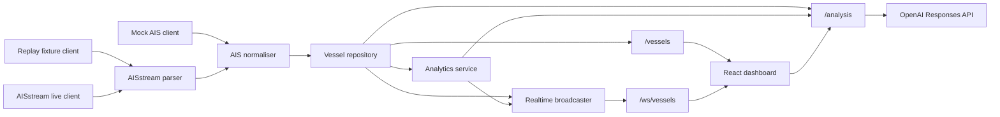

# Architecture

## Monorepo

```text
apps/
  api/       Fastify backend, AIS ingestion, analysis, WebSocket broadcast
  web/       React/Vite dashboard, MapLibre map, Tailwind UI
packages/
  shared/    Zod schemas and TypeScript contracts shared by API and web
```

## Backend Responsibilities

- Validate configuration at startup.
- Own all external AISstream and OpenAI credentials.
- Run AIS ingestion in mock, replay, or live AISstream mode.
- Parse AISstream envelopes and normalise AIS-like messages into shared vessel records.
- Store latest vessel state in an in-memory repository.
- Broadcast normalised updates over a backend WebSocket.
- Expose health, vessel snapshot, stream status, and analysis APIs.
- Ground analysis requests in repository snapshots and analytics.

Required interfaces are implemented in `apps/api/src/domain/interfaces.ts`:

- `IAisStreamClient`
- `IAisMessageNormaliser`
- `IVesselRepository`
- `IVesselAnalyticsService`
- `IRealtimeBroadcaster`
- `IAnalysisAgentService`

## Frontend Responsibilities

- Connect only to our backend.
- Render the MapLibre map and WebGL vessel layers.
- Keep state in dedicated stores.
- Render AIS fields as text only.
- Render analysis output as text only.
- Present map styles and projections through explicit abstractions.

Required frontend abstractions are implemented under `apps/web/src`:

- `IMapStyleProvider`
- `MapStyleRegistry`
- `realtimeClient`
- `apiClient`
- `vesselStore`
- `mapStore`
- `analysisStore`

## Data Flow



## Operating Modes

- Default API startup uses `AIS_MODE=live`, `FLIGHT_MODE=live`, `FLIGHT_PROVIDER=opensky`, and `ANALYSIS_MODE=live`.
- Default startup requires `AISSTREAM_API_KEY` and `OPENAI_API_KEY`.
- `AIS_MODE=live` connects to `wss://stream.aisstream.io/v0/stream`.
- `FLIGHT_MODE=live` connects to the configured flight provider, OpenSky by default.
- `ANALYSIS_MODE=live` uses the OpenAI Responses API.
- `AIS_MODE=mock` uses synthetic local vessel updates.
- `AIS_MODE=replay` uses recorded AISstream-style JSONL fixtures.
- `ANALYSIS_MODE=mock` returns deterministic local analysis.
