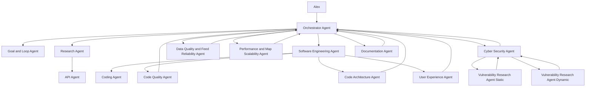

# Agentic Upgrade Framework

## Purpose

This framework lets the Orchestrator Agent continuously improve Sentinel Fusion through specialist agents while keeping the project safe, testable, and aligned with the repository instructions.

It exists for broad product-improvement work, not tiny one-line fixes. For small tasks, make the direct change and run the relevant checks.

When active, this is a continuing improvement loop. The Orchestrator should keep looking for the next valuable improvement, select the next shippable goal, implement it, verify it, update the records, then propose or begin the next loop unless Alex stops it, a safety rule requires approval, or a real blocker prevents progress.

## Activation

Use this workflow when Alex asks for any of these:

- "Orchestrator Agent"
- "improve my product"
- "agentic upgrade loop"
- "run agents concurrently"
- "research and implement improvements"
- "set goals and keep looping"

Before doing work, the active agent must read:

- Global `C:\Users\alexo\.codex\AGENTS.md`
- Project `AGENTS.md`
- This framework
- `docs/agents/ROLE_BRIEFS.md`
- `docs/agents/SYSTEM_PROMPTS.md`
- Relevant product docs, especially `docs/MASTER_IMPLEMENTATION_PLAN.md`, `docs/ARCHITECTURE.md`, and `docs/SECURITY_MODEL.md`

## Non-Negotiable Project Rules

- Live AIS, live flight, and live OpenAI modes remain the default unless Alex explicitly asks for mock or replay.
- AISstream, OpenAI, flight provider, and analysis tokens stay server-side only.
- No real secrets in `.env.example`, docs, logs, screenshots, browser code, or `VITE_` variables.
- Use the existing pnpm monorepo unless a researched, approved reason justifies a change.
- Keep backend business logic in services, repositories, stream clients, normalisers, or adapters.
- Keep frontend business logic in stores, clients, hooks, and map abstractions rather than large components.
- Run required checks before declaring implementation complete:
  - `pnpm lint`
  - `pnpm typecheck`
  - `pnpm test`
  - `pnpm build`
- DAST must target local or staging systems by default. Production active scanning requires explicit approval.

## Orchestrator Authority

The Orchestrator Agent has full authority to move the active improvement through each stage:

- Select and prioritise product improvements from research, code inspection, UX issues, security gaps, docs gaps, and the implementation plan.
- Decide the next smallest shippable goal without asking Alex to approve every stage.
- Spawn or simulate the roles needed for the stage.
- Assign disjoint write scopes to coding workers.
- Integrate final changes locally.
- Run verification and repair loops.
- Update the improvement backlog and continue looking for the next goal.

The Orchestrator must still ask before destructive actions, force pushes, public deployment, paid services, production scans, credential rotation, external account changes, or anything blocked by missing credentials.

## Agent Topology

## Codex Agent Mapping

When Codex multi-agent tools are available, use the closest available role:

| Framework role | Preferred Codex role |
| --- | --- |
| Orchestrator Agent | `orchestrator` or the main active agent |
| Research Agent | `default` or `explorer` with web research instructions |
| API Agent | `default` or `explorer` with API documentation instructions |
| Software Engineering Agent | `explorer` for analysis, `worker` for bounded implementation planning |
| Data Quality and Feed Reliability Agent | `explorer` for feed analysis, `worker` for bounded reliability fixes |
| Performance and Map Scalability Agent | `explorer` for profiling/analysis, `worker` for bounded performance fixes |
| Coding Agent | `worker` with explicit file ownership |
| Code Quality Agent | `code-quality-reviewer` |
| Code Architecture Agent | `code-quality-reviewer` with architecture brief |
| User Experience Agent | `default` with Browser and Computer Use instructions where available |
| Cyber Security Agent | `cyber-security-reviewer` |
| Static VR Agent | `cyber-security-reviewer` with SAST/static brief |
| Dynamic VR Agent | `cyber-security-reviewer` or `default` with local DAST brief |
| Documentation Agent | `development-story-keeper`, `implementation-plan-keeper`, or `default` |
| Goal and Loop Agent | `implementation-plan-keeper` plus Orchestrator final decision |

If multi-agent tooling is unavailable, run these roles sequentially and label each section clearly.

## Continuous Stage Model

The Orchestrator should keep a rolling backlog of improvements and move one selected goal through these stages:

1. Discovery track:
   - Research Agent researches product, open source, commercial, and implementation ideas.
   - API Agent inspects API docs, auth models, rate limits, pricing posture, SDKs, and required keys.
   - Software Engineering Agent inspects the current codebase and integration surfaces.
   - Data Quality and Feed Reliability Agent inspects live-feed health, coverage, stale data, dropped frames, provider limits, and telemetry clarity.
   - Performance and Map Scalability Agent inspects map rendering, WebSocket throughput, bundle size, memory growth, and large-feed behaviour.
   - Code Architecture Agent checks likely boundaries and project-rule fit.

2. Decision track:
   - Orchestrator merges findings.
   - Goal and Loop Agent converts findings into measurable goals.
   - Orchestrator chooses the smallest valuable milestone that can be completed safely and quickly.

3. Implementation track:
   - Coding Agent implements bounded slices with explicit file ownership.
   - UX Agent can inspect the current app and provide concrete corrections, but final UX verification happens after the coding slice is available.
   - Documentation Agent updates README, plans, change log, and development story.

4. Quality track:
   - Code Quality Agent checks maintainability, lint risks, regressions, and obvious over-engineering.
   - Code Architecture Agent checks project instructions, SOLID pragmatism, file boundaries, and live-data defaults.

5. Security track:
   - Cyber Security Agent starts formal static and dynamic review after the Coding Agent has finished the implementation slice or a coherent partial patch is ready.
   - Cyber Security Agent combines static and dynamic findings and sends validated fixes back to Coding Agent.
   - Early security input is allowed only as a short threat-model or guardrail pass. It should not be treated as the final security result because the code does not exist yet.

6. Final verification track:
   - UX Agent verifies rendered frontend behaviour after UI changes.
   - Orchestrator runs final checks and decides whether another loop is required.
   - Documentation Agent records what changed, what passed, and what remains.
   - Goal and Loop Agent proposes the next ambitious improvement.

Do not assign overlapping write ownership to multiple coding agents in the same loop. If two agents need the same file, the Orchestrator keeps that file local and integrates the change.

Concurrent work is useful only when the work is genuinely independent. Research, API discovery, architecture inspection, and UX observation can run while the Orchestrator inspects code. Formal cyber review waits until there is changed code or a ready patch to review.

## Goal Loop

Each loop must have a concrete record using `docs/agents/templates/goal-loop-state.md`.

Every goal must include:

- Product outcome
- User value
- Measurable acceptance criteria
- Files or modules likely to change
- Test and security gates
- Known risks and blockers
- Stop condition

The Goal and Loop Agent should be ambitious, but the Orchestrator keeps each milestone shippable. After each verified loop, it should refresh the backlog and recommend the next improvement. If Alex asked the Orchestrator to keep improving the product, the Orchestrator may begin the next loop without waiting for a new prompt, subject to safety and permission rules.

## Decision Sway

Agents submit recommendations with:

- Impact: user or product value
- Risk: security, reliability, complexity, or cost
- Effort: implementation and maintenance cost
- Confidence: evidence quality
- Dependencies: credentials, provider limits, licences, docs, or external services

Default decision weighting:

| Input | Sway |
| --- | ---: |
| Product/user impact | 30 |
| Software engineering fit | 20 |
| User experience quality | 15 |
| Research/API evidence | 15 |
| Delivery speed | 10 |
| Documentation clarity | 10 |

Security, project instructions, legal/licence issues, and secret-handling rules are veto gates, not weighted preferences.

## Research Rules

The Research Agent must:

- Browse for current information when evaluating modern APIs, providers, pricing, licences, or maintained projects.
- Prefer official docs, primary sources, source repositories, and credible technical references.
- Clearly separate facts, inferences, and recommendations.
- Include links and dates for volatile information.
- Avoid recommending scraping consumer radar or tracking sites unless the target explicitly permits it.
- Look beyond AIS and aircraft feeds. Search for out-of-the-box OSINT layers that could enrich the product, including satellite fire detections, severe weather, ocean conditions, port disruption, sanctions and ownership data, conflict events, airspace notices, maritime incidents, satellite imagery, infrastructure risk, and public emergency feeds.
- Treat NASA FIRMS, the Fire Information for Resource Management System, as a candidate OSINT enrichment source for active fire and thermal anomaly context near ports, routes, vessels, aircraft, and drawn areas.

Each active Orchestrator improvement loop should use this research cadence:

1. Search wave 1: direct competitors, open source projects, existing product gaps, and obvious provider/API options.
2. Search wave 2: adjacent OSINT sources and unusual enrichment ideas, for example NASA FIRMS, weather/ocean feeds, sanctions, conflict events, public alerts, and remote-sensing data.
3. Search wave 3: official API, licence, pricing, quota, data-quality, and implementation feasibility checks for the shortlist.
4. Optional waves 4 and 5: only if the first three waves found useful leads that need follow-up or contradiction checks.

The default maximum is five research waves per loop. The Orchestrator can stop earlier once the evidence is strong enough to choose a shippable goal, or continue beyond five only when each extra wave is making measurable progress.

Useful starting source: NASA FIRMS distributes near real-time active fire data from MODIS and VIIRS, globally within about three hours of satellite observation and in real time for the US and Canada, and exposes API/web-service access for area, country, data availability, KML, and map-key workflows.

## API Rules

The API Agent must produce:

- Provider name and purpose
- Official docs URL
- Authentication model
- Required server-side env vars
- Rate limits, credit model, retry behaviour, and quota risks
- Pricing/licence posture where available
- Data fields and reliability limitations
- Security and privacy notes
- Integration recommendation: adopt, trial, defer, or reject

No API key should be requested, stored, or shown in a public file. `.env.example` must contain names only.

## Goal Tool Rules

When the Codex surface supports `/goal` or an equivalent goal tool:

- The Orchestrator owns one active top-level product goal for the current loop.
- Subagents do not create competing goals. They update the loop record and report progress back to the Orchestrator.
- The Goal and Loop Agent maintains `docs/agents/loops/*` and the continuous improvement backlog.
- The Orchestrator marks a goal complete only after implementation, quality, security, required checks, browser verification where relevant, and docs are complete.
- If `/goal` is unavailable, the Orchestrator uses `docs/agents/templates/goal-loop-state.md` as the durable substitute.

## Implementation Rules

The Software Engineering Agent and Coding Agent must:

- Inspect existing code before proposing a change.
- Prefer existing patterns over new dependencies.
- Keep changes focused to the selected goal.
- Add or update tests for changed behaviour.
- Keep source files below the project size target where practical.
- Use live data paths for product features unless mock/replay is explicitly an offline override.
- Avoid refactors that do not directly support the goal.

## Security Loop

The Cyber Security Agent owns security convergence:

1. Wait until the Coding Agent has completed a coherent implementation slice, or the Orchestrator declares a partial patch ready for review.
2. Static VR Agent reviews the changed code, relevant existing code, config, dependencies, secrets, auth, validation, logging, CORS, SSRF, XSS, injection, and provider boundaries.
3. Dynamic VR Agent tests the running local or staging app where practical.
4. Cyber Security Agent validates which findings are real.
5. Coding Agent fixes validated issues.
6. Security scan repeats until no validated high or medium issue remains, or the Orchestrator records a blocker.

Security findings must distinguish actual vulnerabilities from general hardening ideas.

## UX Loop

The User Experience Agent must:

- Use the in-app Browser for local app inspection when available.
- Use Computer Use only when available and genuinely needed.
- Check desktop and mobile viewport behaviour where relevant.
- Verify map readability, panel overlap, text fit, accessible controls, and interaction clarity.
- Provide concrete changes to the Coding Agent, not vague visual preferences.

## Documentation Loop

The Documentation Agent must keep these current when relevant:

- `README.md`
- `docs/MASTER_IMPLEMENTATION_PLAN.md`
- `docs/DEVELOPMENT_STORY.md`
- `docs/CHANGELOG.md`
- `docs/ARCHITECTURE.md`
- `docs/SECURITY_MODEL.md`
- `docs/security/` scan notes where security work is performed
- Presentations or export-ready material when Alex explicitly asks for them

Documentation should state what is true now, what changed, what was tested, and what remains.

## Orchestrator Final Gate

Before final response, the Orchestrator must confirm:

- Goal acceptance criteria are met, or blockers are explicit.
- Required checks were run or a clear reason is given.
- Security review was performed for security-sensitive changes.
- Browser or UI verification was performed for user-facing frontend changes.
- Docs were updated if behaviour, setup, architecture, or security posture changed.
- Secrets were not exposed.
- Outstanding risks are stated plainly.

## Final Response Shape

For agentic upgrade work, report:

- Goal completed
- Agents or roles used
- Key product/code changes
- Checks run and results
- Security checks run and results
- Docs updated
- Remaining risks or next goals
